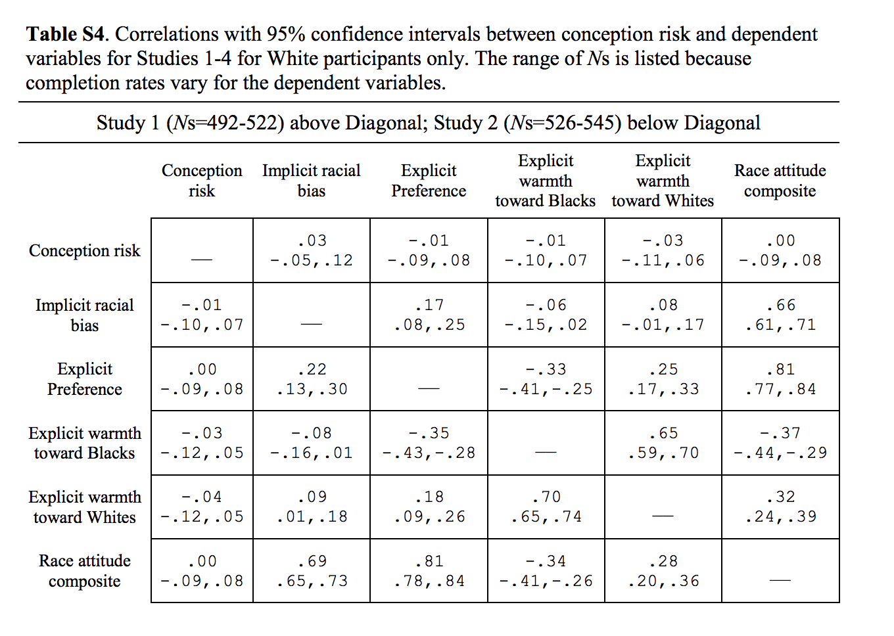

# Report Details

```{r}
articleID <- 16-2-2015 # insert the article ID code here e.g., "10-3-2015_PS"
reportType <- 'final' # specify whether this is the 'pilot' report or 'final' report
pilotNames <- 'Emily Hembacher' # insert the pilot's name here e.g., "Tom Hardwicke".  If there are multiple cpilots enter both names in a character string e.g., "Tom Hardwicke, Bob Dylan"
copilotNames <- 'Tom Hardwicke' # # insert the co-pilot's name here e.g., "Michael Frank". If there are multiple co-pilots enter both names in a character string e.g., "Tom Hardwicke, Bob Dylan"
pilotTTC <- 300 # insert the pilot's estimated time to complete (in minutes, fine to approximate) e.g., 120
copilotTTC <- NA # insert the co-pilot's estimated time to complete (in minutes, fine to approximate) e.g., 120
pilotStartDate <- as.Date("06/13/18", format = "%m/%d/%y") # insert the pilot's start date in US format e.g., as.Date("01/25/18", format = "%m/%d/%y")
copilotStartDate <- as.Date("06/21/18", format = "%m/%d/%y") # insert the co-pilot's start date in US format e.g., as.Date("01/25/18", format = "%m/%d/%y")
completionDate <- NA # copilot insert the date of final report completion (after any necessary rounds of author assistance) in US format e.g., as.Date("01/25/18", format = "%m/%d/%y")
```

------

#### Methods summary: 

The authors attempted to replicate previous findings that conception risk is related to women's racial bias. Specifically, previous research had found that women who had a higher likelihood of becoming pregnant given the day in their menstrual cycle exhibited stronger racial biases favoring White men over Black men on a variety of measures. The authors of the present study attempted to replicate this in a high-powered design. In Study 1 (which we attempt to reproduce in this report), 867 women were recruited. Participants' current menstrual cycle day was used to estimate conception-risk. Participants' explicit racial biases (explicit racial preference, explicit warmth towards Whites, explicit warmth towards Blacks) were estimated from self-report measures and implicit racial bias were estimated from Implicit Association Tests. Correlations with 95% confidence intervals were reported between conception risk and the explicit and implicit bias measures.

------

#### Target outcomes: 

We will attempt to reproduce all findings related to Study 1 in the quoted text:

> For all racial measures, higher scores represented pro-White bias. The mean score for implicit racial bias was 0.34 (SD = 0.43) in Study 1, 0.33 (SD = 0.42) in Study 2, 0.27 (SD = 0.41) in Study 3, and 0.18 (SD = 0.37) in Study 4. The mean score for explicit racial bias was 0.30 (SD = 1.09) in Study 1, 0.30 (SD = 1.05) in Study 2, 0.27 (SD = 0.83) in Study 3, and 0.53 (SD = 1.05) in Study 4. Mean rated warmth toward European Americans was 7.18 (SD = 2.07) in Study 1 and 7.15 (SD = 2.00) in Study 2, and mean rated warmth toward African Americans was 6.69 (SD = 2.06) in Study 1 and 6.78 (SD = 2.12) in Study 2. The mean score for explicit physicality stereotypes was 0.80 (SD = 0.83) in Study 3 and 0.81 (SD = 0.85) in Study 4, and the mean score for implicit physicality stereotypes was 0.26 (SD = 0.36) in Study 3 and 0.21 (SD = 0.38) in Study 4. As in Navarrete et al. (2009), we created composite bias scores in each study by standardizing and then averaging all racial-bias measures (warmth toward African Americans was subtracted from warmth toward European Americans to create a warmth difference score prior to standardizing). Mean conception risk was 0.03 (SD = 0.03) in Study 1, 0.03 (SD = 0.03) in Study 2, 0.04 (SD = 0.03) in Study 3, and 0.03 (SD = 0.03) in Study 4. Correlations were computed between conception risk and each race variable, including the composite score. To best match the existing literature, we computed correlations for White women only (see the Supplemental Material for additional analyses). Conception risk did not significantly correlate with any of the individual measures of racial bias (see Table S4 in the Supplemental Material) or with the composite score in Study 1, r = .00, 95% confidence interval (CI) = [−.09, .08]; Study 2, r = .00, 95% CI = [−.09, .08]; Study 3, r = .03, 95% CI = [−.17, .22]; or Study 4, r = .05, 95% CI = [−.11, .21]. (Hawkins, Fitzgerald & Nosek, 2014, p. 250)

------

```{r global_options, include=FALSE}
# sets up some formatting options for the R Markdown document
knitr::opts_chunk$set(echo=TRUE, warning=FALSE, message=FALSE)
```

# Step 1: Load packages and prepare report object

```{r}
# load packages
library(tidyverse) # for data munging
library(knitr) # for kable table formating
library(haven) # import and export 'SPSS', 'Stata' and 'SAS' Files
library(readxl) # import excel files
library(CARPSreports) # custom report functions
library(magrittr)
library(Hmisc)
```

```{r}
# Prepare report object. This will be updated automatically by the reproCheck function each time values are compared
reportObject <- data.frame(dummyRow = TRUE, reportedValue = NA, obtainedValue = NA, valueType = NA, percentageError = NA, comparisonOutcome = NA, eyeballCheck = NA)
```

# Step 2: Load data

```{r}
#load full raw data. authors also included a pre-processed data file with excluded participants and standardized variables, but we will attempt to work from the raw data.
d_raw <-read_excel('data/study1/Study_1_full.xls')
```

# Step 3: Tidy data

```{r}
#add variable for subject ID; otherwise data is already in tidy format
d_raw$sid <- 1:length(d_raw$session_status)
```

# Step 4: Run analysis

## Pre-processing

>...we excluded women who: (a) reported contraceptive use, that they were currently pregnant or uncertain of current pregnancy status, as well as women whose current cycle was day 41 or higher or had a previous cycle of irregular length - less than 20 days or more than 40 days; or (b) women who reported infertility due to menopause or some other health reason, or if they reported that they were uncertain of reproductive status, preferred not to say, or they left the reproductive question blank. After these exclusions, Study 1 contained 867 women and Study 2 contained 878 women with a valid conception risk score. (Supplementary Materials for Hawkins, Fitzgerald, & Nosek (2014) p. 1)

```{r}
d <- d_raw %>%
  filter(repstatus == "fertile",
         currentcycle_day < 41,
         currentcycle_day > 0,
         cycle_length >= 20,
         cycle_length <= 40,
         pregnow == "no")
```

>...we created composite bias scores in each study by standardizing and then averaging all racial-bias measures (warmth toward African Americans was subtracted from warmth toward European Americans to create a warmth difference score prior to standardizing).(Hawkins, Fitzgerald & Nosek, 2014, p. 250)

```{r}
d%<>%
  mutate(zIAT = scale(IAT, center = TRUE, scale = TRUE), #calculate z scores for variables
         zattitude = scale(attitude, center = TRUE, scale = TRUE), 
         zwarmth_black = scale(warmth_black, center = TRUE, scale = TRUE),
         zwarmth_white = scale(warmth_white, center = TRUE, scale = TRUE),
         zrisk = scale(risk, center = TRUE, scale = TRUE),
         zwarmth_diff = zwarmth_white - zwarmth_black, #calculate warmth difference score
         zatt_composite = (zIAT + zattitude + zwarmth_diff)/3) #calculate composite score by averaging bias scores
```

## Descriptive statistics

>The mean score for implicit racial bias was 0.34 (SD = 0.43) in Study 1 (Hawkins, Fitzgerald & Nosek, 2014, p. 250)

```{r}
ms_implicit_bias <- d%>%
  filter(!is.na(IAT))%>%
  summarise(mean = mean(IAT), sd = sd(IAT))

reportObject <- reproCheck(reportedValue = '.34', obtainedValue = ms_implicit_bias$mean, valueType = 'mean')
reportObject <- reproCheck(reportedValue = '.43', obtainedValue = ms_implicit_bias$sd, valueType = 'sd')
```

>The mean score for explicit racial bias was 0.30 (SD = 1.09) in Study 1 (Hawkins, Fitzgerald & Nosek, 2014, p. 250)

```{r}
ms_explicit_bias <- d%>%
  filter(!is.na(attitude))%>%
  summarise(mean = mean(attitude), sd = sd(attitude))

reportObject <- reproCheck(reportedValue = '.30', obtainedValue = ms_explicit_bias$mean, valueType = 'mean')
reportObject <- reproCheck(reportedValue = '1.09', obtainedValue = ms_explicit_bias$sd, valueType = 'sd')
```

>Mean rated warmth toward European Americans was 7.18 (SD = 2.07) in Study 1 (Hawkins, Fitzgerald & Nosek, 2014, p. 250)

```{r}
ms_warmth_white <- d%>%
  filter(!is.na(warmth_white))%>%
  summarise(mean = mean(warmth_white), sd = sd(warmth_white))

reportObject <- reproCheck(reportedValue = '7.18', obtainedValue = ms_warmth_white$mean, valueType = 'mean')
reportObject <- reproCheck(reportedValue = '2.07', obtainedValue = ms_warmth_white$sd, valueType = 'sd')
```

>mean rated warmth toward African Americans was 6.69 (SD = 2.06) in Study 1 (Hawkins, Fitzgerald & Nosek, 2014, p. 250)

```{r}
ms_warmth_black <- d%>%
  filter(!is.na(warmth_black))%>%
  summarise(mean = mean(warmth_black), sd = sd(warmth_black))

reportObject <- reproCheck(reportedValue = '6.69', obtainedValue = ms_warmth_black$mean, valueType = 'mean')
reportObject <- reproCheck(reportedValue = '2.06', obtainedValue = ms_warmth_black$sd, valueType = 'sd')
```

>Mean conception risk was 0.03 (SD = 0.03) in Study 1 (Hawkins, Fitzgerald & Nosek, 2014, p. 250)

```{r}
ms_risk <- d%>%
  filter(!is.na(risk))%>%
  summarise(mean = mean(risk), sd = sd(risk))

reportObject <- reproCheck(reportedValue = '.03', obtainedValue = ms_risk$mean, valueType = 'mean')
reportObject <- reproCheck(reportedValue = '.03', obtainedValue = ms_risk$sd, valueType = 'sd')
```

## Inferential statistics

>Correlations were computed between conception risk and each race variable, including the composite score. To best match the existing literature, we computed correlations for White women only...

>Conception risk did not significantly correlate with any of the individual measures of racial bias (see Table S4 in the Supplemental Material) or with the composite score in Study 1, r = .00, 95% confidence interval (CI) = [−.09, .08] (Hawkins, Fitzgerald & Nosek, 2014, p. 250)

In the following section, we attempt to reproduce the correlations (with 95% confidence intervals) reported in Table S4 for Study 1.



```{r}
cortab <- d %>%
  filter(race == "6") #filter for White women

#Conception risk and Implicit racial bias
risk_implicit_cor <- cor.test(cortab$zrisk, cortab$zIAT,
         method = c("pearson"),
         conf.level = 0.95)

reportObject <- reproCheck(reportedValue = '.03', obtainedValue = unname(risk_implicit_cor$estimate), valueType = 'r')
reportObject <- reproCheck(reportedValue = '-.05', obtainedValue = unname(risk_implicit_cor$conf.int[1]), valueType = 'ci')
reportObject <- reproCheck(reportedValue = '.12', obtainedValue = unname(risk_implicit_cor$conf.int[2]), valueType = 'ci')

#Conception risk and Explicit preference
risk_explicit_cor <- cor.test(cortab$zrisk, cortab$zattitude,
         method = c("pearson"),
         conf.level = 0.95)

reportObject <- reproCheck(reportedValue = '-.01', obtainedValue = unname(risk_explicit_cor$estimate), valueType = 'r')
reportObject <- reproCheck(reportedValue = '-.09', obtainedValue = unname(risk_explicit_cor$conf.int[1]), valueType = 'ci')
reportObject <- reproCheck(reportedValue = '.08', obtainedValue = unname(risk_explicit_cor$conf.int[2]), valueType = 'ci')

#Conception risk and Explicit warmth toward Blacks
risk_warmth_blacks_cor <- cor.test(cortab$zrisk, cortab$zwarmth_black,
         method = c("pearson"),
         conf.level = 0.95)

reportObject <- reproCheck(reportedValue = '-.01', obtainedValue = unname(risk_warmth_blacks_cor$estimate), valueType = 'r')
reportObject <- reproCheck(reportedValue = '-.10', obtainedValue = unname(risk_warmth_blacks_cor$conf.int[1]), valueType = 'ci')
reportObject <- reproCheck(reportedValue = '.07', obtainedValue = unname(risk_warmth_blacks_cor$conf.int[2]), valueType = 'ci')

#Conception risk and Explicit warmth towards Whites
risk_warmth_whites_cor<- cor.test(cortab$zrisk, cortab$zwarmth_white,
         method = c("pearson"),
         conf.level = 0.95)

reportObject <- reproCheck(reportedValue = '-.03', obtainedValue = unname(risk_warmth_whites_cor$estimate), valueType = 'r')
reportObject <- reproCheck(reportedValue = '-.11', obtainedValue = unname(risk_warmth_whites_cor$conf.int[1]), valueType = 'ci')
reportObject <- reproCheck(reportedValue = '.06', obtainedValue = unname(risk_warmth_whites_cor$conf.int[2]), valueType = 'ci')

#Conception risk and Race attitude composite
risk_atts_comp_cor <- cor.test(cortab$zrisk, cortab$zatt_composite,
         method = c("pearson"),
         conf.level = 0.95)

reportObject <- reproCheck(reportedValue = '.00', obtainedValue = unname(risk_atts_comp_cor$estimate), valueType = 'r')
reportObject <- reproCheck(reportedValue = '-.09', obtainedValue = unname(risk_atts_comp_cor$conf.int[1]), valueType = 'ci')
reportObject <- reproCheck(reportedValue = '.08', obtainedValue = unname(risk_atts_comp_cor$conf.int[2]), valueType = 'ci')

#Implicit racial bias and Explicit Preference
implicit_explicit_cor <- cor.test(cortab$zIAT,cortab$zattitude,
         method = c("pearson"),
         conf.level = 0.95)

reportObject <- reproCheck(reportedValue = '.17', obtainedValue = unname(implicit_explicit_cor$estimate), valueType = 'r')
reportObject <- reproCheck(reportedValue = '.08', obtainedValue = unname(implicit_explicit_cor$conf.int[1]), valueType = 'ci')
reportObject <- reproCheck(reportedValue = '.25', obtainedValue = unname(implicit_explicit_cor$conf.int[2]), valueType = 'ci')

#Implicit racial bias and Explicit Warmth towards Blacks
implicit_warmth_black_cor <- cor.test(cortab$zIAT, cortab$zwarmth_black, 
         method = c("pearson"),
         conf.level = 0.95)

reportObject <- reproCheck(reportedValue = '-.06', obtainedValue = unname(implicit_warmth_black_cor$estimate), valueType = 'r')
reportObject <- reproCheck(reportedValue = '-.15', obtainedValue = unname(implicit_warmth_black_cor$conf.int[1]), valueType = 'ci')
reportObject <- reproCheck(reportedValue = '.02', obtainedValue = unname(implicit_warmth_black_cor$conf.int[2]), valueType = 'ci')

#Implicit racial bias and Explicit Warmth towards Whites
implicit_warmth_white_cor <- cor.test(cortab$zIAT, cortab$zwarmth_white,
         method = c("pearson"),
         conf.level = 0.95)

reportObject <- reproCheck(reportedValue = '.08', obtainedValue = unname(implicit_warmth_white_cor$estimate), valueType = 'r')
reportObject <- reproCheck(reportedValue = '-.01', obtainedValue = unname(implicit_warmth_white_cor$conf.int[1]), valueType = 'ci')
reportObject <- reproCheck(reportedValue = '.17', obtainedValue = unname(implicit_warmth_white_cor$conf.int[2]), valueType = 'ci')

#Implicit racial bias and Race attitude composite
implicit_attscomp_cor <- cor.test(cortab$zIAT, cortab$zatt_composite,
         method = c("pearson"),
         conf.level = 0.95)

reportObject <- reproCheck(reportedValue = '.66', obtainedValue = unname(implicit_attscomp_cor$estimate), valueType = 'r')
reportObject <- reproCheck(reportedValue = '.61', obtainedValue = unname(implicit_attscomp_cor$conf.int[1]), valueType = 'ci')
reportObject <- reproCheck(reportedValue = '.71', obtainedValue = unname(implicit_attscomp_cor$conf.int[2]), valueType = 'ci')

#Explicit Preference and Explicit Warmth towards Blacks
explicit_warmth_black_cor <- cor.test(cortab$zattitude, cortab$zwarmth_black,
         method = c("pearson"),
         conf.level = 0.95)

reportObject <- reproCheck(reportedValue = '-.33', obtainedValue = unname(explicit_warmth_black_cor$estimate), valueType = 'r')
reportObject <- reproCheck(reportedValue = '-.41', obtainedValue = unname(explicit_warmth_black_cor$conf.int[1]), valueType = 'ci')
reportObject <- reproCheck(reportedValue = '-.25', obtainedValue = unname(explicit_warmth_black_cor$conf.int[2]), valueType = 'ci')

#Explicit Preference and Explicit Warmth towards Whites
explicit_warmth_white_cor <- cor.test(cortab$zattitude, cortab$zwarmth_white,
         method = c("pearson"),
         conf.level = 0.95)

reportObject <- reproCheck(reportedValue = '.25', obtainedValue = unname(explicit_warmth_white_cor$estimate), valueType = 'r')
reportObject <- reproCheck(reportedValue = '.17', obtainedValue = unname(explicit_warmth_white_cor$conf.int[1]), valueType = 'ci')
reportObject <- reproCheck(reportedValue = '.33', obtainedValue = unname(explicit_warmth_white_cor$conf.int[2]), valueType = 'ci')

#Explicit Preference and Race attitude composite
explicit_attcomp_cor <- cor.test(cortab$zattitude, cortab$zatt_composite,
         method = c("pearson"),
         conf.level = 0.95)

reportObject <- reproCheck(reportedValue = '.81', obtainedValue = unname(explicit_attcomp_cor$estimate), valueType = 'r')
reportObject <- reproCheck(reportedValue = '.77', obtainedValue = unname(explicit_attcomp_cor$conf.int[1]), valueType = 'ci')
reportObject <- reproCheck(reportedValue = '.84', obtainedValue = unname(explicit_attcomp_cor$conf.int[2]), valueType = 'ci')

#Explicit Warmth toward Blacks and Explicit Warmth towards Whites
warmth_black_warmth_white_cor <- cor.test(cortab$zwarmth_black, cortab$zwarmth_white,
         method = c("pearson"),
         conf.level = 0.95)

reportObject <- reproCheck(reportedValue = '.65', obtainedValue = unname(warmth_black_warmth_white_cor$estimate), valueType = 'r')
reportObject <- reproCheck(reportedValue = '.59', obtainedValue = unname(warmth_black_warmth_white_cor$conf.int[1]), valueType = 'ci')
reportObject <- reproCheck(reportedValue = '.70', obtainedValue = unname(warmth_black_warmth_white_cor$conf.int[2]), valueType = 'ci')

#Explicit Warmth toward Blacks and Race attitude composite
warmth_black_attscomp <- cor.test(cortab$zwarmth_black, cortab$zatt_composite,
         method = c("pearson"),
         conf.level = 0.95)

reportObject <- reproCheck(reportedValue = '-.37', obtainedValue = unname(warmth_black_attscomp$estimate), valueType = 'r')
reportObject <- reproCheck(reportedValue = '-.44', obtainedValue = unname(warmth_black_attscomp$conf.int[1]), valueType = 'ci')
reportObject <- reproCheck(reportedValue = '-.29', obtainedValue = unname(warmth_black_attscomp$conf.int[2]), valueType = 'ci')

#Explicit Warmth toward Whites and Race attitude composite
warmth_white_attscomp <- cor.test(cortab$zwarmth_white, cortab$zatt_composite,
         method = c("pearson"),
         conf.level = 0.95)

reportObject <- reproCheck(reportedValue = '.32', obtainedValue = unname(warmth_white_attscomp$estimate), valueType = 'r')
reportObject <- reproCheck(reportedValue = '.24', obtainedValue = unname(warmth_white_attscomp$conf.int[1]), valueType = 'ci')
reportObject <- reproCheck(reportedValue = '.39', obtainedValue = unname(warmth_white_attscomp$conf.int[2]), valueType = 'ci')
```

# Step 5: Conclusion

We found several discrepencies between values reported in the text and our obtained values. The authors included a table of correlations with 95% confidence intervals between the different dependent measures (available in Supplemental Materials). We noted several major errors in correlation coefficients (r values) and confidence intervals. It is not clear to us what the source of the discrepency is, although it could be that different software packages (the authors used SAS and we are using R) give different values for these tests. None of the errors amount to decision errors or change the conclusions. 

All descriptive statistics reported in the paper matched our obtained values.

```{r}
Author_Assistance = FALSE # was author assistance provided? (if so, enter TRUE)

Insufficient_Information_Errors <- 0 # how many discrete insufficient information issues did you encounter?

# Assess the causal locus (discrete reproducibility issues) of any reproducibility errors. Note that there doesn't necessarily have to be a one-to-one correspondance between discrete reproducibility issues and reproducibility errors. For example, it could be that the original article neglects to mention that a Greenhouse-Geisser correct was applied to ANOVA outcomes. This might result in multiple reproducibility errors, but there is a single causal locus (discrete reproducibility issue).

locus_typo <- NA # how many discrete issues did you encounter that related to typographical errors?
locus_specification <- NA # how many discrete issues did you encounter that related to incomplete, incorrect, or unclear specification of the original analyses?
locus_analysis <- NA # how many discrete issues did you encounter that related to errors in the authors' original analyses?
locus_data <- NA # how many discrete issues did you encounter that related to errors in the data files shared by the authors?
locus_unidentified <- NA # how many discrete issues were there for which you could not identify the cause

Affects_Conclusion <- NA # Do any reproducibility issues encounter appear to affect the conclusions made in the original article? TRUE, FALSE, or NA. This is a subjective judgement, but you should taking into account multiple factors, such as the presence/absence of decision errors, the number of target outcomes that could not be reproduced, the type of outcomes that could or could not be reproduced, the difference in magnitude of effect sizes, and the predictions of the specific hypothesis under scrutiny.
```

```{r}
reportObject <- reportObject %>%
  filter(dummyRow == FALSE) %>% # remove the dummy row
  select(-dummyRow) %>% # remove dummy row designation
  mutate(articleID = articleID) %>% # add variables to report 
  select(articleID, everything()) # make articleID first column

# decide on final outcome
if(any(reportObject$comparisonOutcome != "MATCH") | Insufficient_Information_Errors > 0){
  finalOutcome <- "Failure without author assistance"
  if(Author_Assistance == T){
    finalOutcome <- "Failure despite author assistance"
  }
}else{
  finalOutcome <- "Success without author assistance"
  if(Author_Assistance == T){
    finalOutcome <- "Success with author assistance"
  }
}

# collate report extra details
reportExtras <- data.frame(articleID, pilotNames, copilotNames, pilotTTC, copilotTTC, pilotStartDate, copilotStartDate, completionDate, Author_Assistance, finalOutcome, Insufficient_Information_Errors, locus_typo, locus_specification, locus_analysis, locus_data, locus_unidentified)

# save report objects
if(reportType == "pilot"){
  write_csv(reportObject, "pilotReportDetailed.csv")
  write_csv(reportExtras, "pilotReportExtras.csv")
}

if(reportType == "final"){
  write_csv(reportObject, "finalReportDetailed.csv")
  write_csv(reportExtras, "finalReportExtras.csv")
}
```

# Session information

```{r session_info, include=TRUE, echo=TRUE, results='markup'}
devtools::session_info()
```
